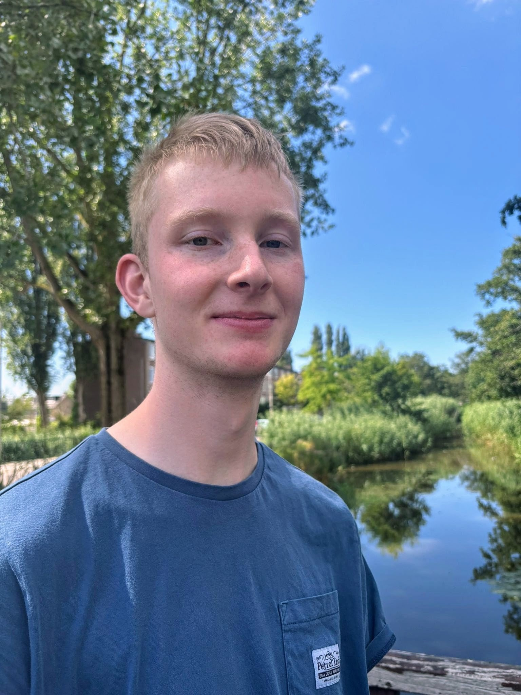

+++
title = "Over mij"
+++

  
   

As a Computer Vision Engineer with an HBO Bachelor’s and a WO Master’s, I bridge the gap between deep research and practical execution.

**I am at my best when going quickly from a concept to a working prototype.** I don't follow rigid blueprints; instead, I rely on my intuition to build creative, out-of-the-box solutions that get the job done. I love learning new things on the fly and immediately applying them to solve real problems.

### Technical Expertise
- **Computer Vision & ML:** OpenCV, PyTorch, Scikit-learn (Sklearn)
- **Data Analysis & Core Math:** NumPy, Pandas
- **Programming Languages:** Python, C/C++, Rust, Julia
- **Robotics:** ROS2, Gazebo
- **Software Development:** Git, CI/CD

