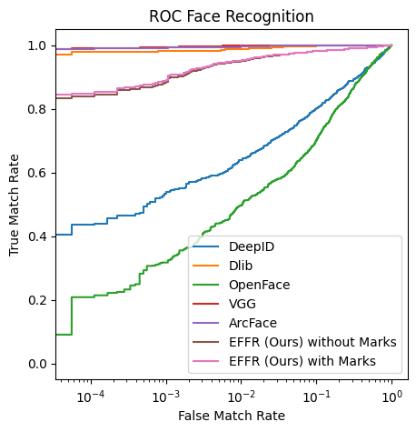

+++
title = "Explainable Forensic Face Recognition (EFFR) Based on FISWG Features"
description = ""
weight = 1
date = 2026-05-29

[extra]
tags = ["ROS2", "Gazebo", "python", "C++"]
local_image = "/projects/Explainable Face Recognition/thumbnail.png"
+++

You can read the full paper here: [Download PDF (Explainable Forensic Face Recognition based on FISWG Features.pdf)](<Explainable Forensic Face Recognition based on FISWG Features.pdf>)

# Introduction

Developed an Explainable Forensic Face Recognition (EFFR) model, an innovative "explainable-by-design" biometric system tailored for forensic and legal use. Moving away from traditional deep learning black-box systems, the architecture incorporates international Facial Identification Scientific Working Group (FISWG) guidelines to break facial data into human-verifiable features. By combining deep learning pre-processing with classical computer vision, the model translates complex feature comparisons into Likelihood Ratios (LR) to demonstrate statistical evidence strength.

# Project Details

- **Core Tech:** Python, OpenCV, NumPy, PyTorch, Scikit-Learn.
- **AI Components:** HRNet (High-Resolution Network for landmarks), BiSeNet (Bilateral Segmentation Network), YOLOv11M (Object detection for facial marks).
- **Classical Computer Vision:** Fourier Shape Descriptors (FSD), Local Binary Patterns (LBP), Gray-Level Co-occurrence Matrix (GLCM), Haralick Features.
- **Machine Learning:** Logistic Regression, Isolation Forest (Anomaly Detection), Agglomerative Clustering.
- **Forensic:** Score-based Likelihood Ratios (SLR), 
- **Dataset:** PUT Face Database (10,000 images, 100 subjects).

# The Challenge

- **The Black-Box:** State-of-the-art face recognition models produce complex high-dimensional embeddings that are unintelligible to human juries and forensic examiners.
- **Failure of Post-Hoc Explanations:** Retroactive approach tools like Class Activation Mapping (CAM) or LIME produce simple heatmaps that show _what_ pixels a model evaluated but fail to explain _why_ a biometric decision was reached.
- **Translating Human Linguistics to quantitative features:** Mapping highly qualitative FISWG descriptions (such as ear helix curvatures or eyebrow shapes) into precise, reproducible quantitative data structures.

# Key Features

- **Hybrid AI/Classical Architecture:** Utilized deep learning (HRNet & BiSeNet) for high-precision semantic segmentation and landmark tracking, passing those clean pixel-level outputs into deterministic classical vision pipelines.
- **Anatomical Feature Extractions:**
    - _Ears:_ Extracted the ear region via face parsing, detected localized points, and mathematically mapped the curvature using second-degree polynomial residuals and root-mean-square angular transitions.
    - _Eyebrows:_ Segmented rows into 4 quadrants, deploying a uniform rotation-invariant LBP histogram to differentiate edge/corner bins (representing individual hairs) from flat states (skin) to map density distributions.
    - _Mouth & Lips:_ Fitted Fourier Shape Descriptors across 4 boundaries to capture lip shapes while running a column-wise 1D Gaussian smooth over regions of interest to extract clean lip fissures.
    - _Skin:_ Isolated valid regions via erosion, choosing 50 random patches to evaluate micro-textures through multi-radius LBP and GLCM matrices.
- **Facial Mark Tracking (YOLOv11M):** Trained a middleweight object detection model on high-resolution ($1280\times1280$ pixels) images to detect anomalies like moles or freckles. Used perspective-n-point pose computation (solvePnP) to map 2D image coordinates onto a 3D cylindrical head model to track spatial distances.
- **Hierarchical Statistical Fusing:** Standardized raw comparison features via a Yeo-Johnson power transform, training a Logistic Regression model over normalized inputs to synthesize features into higher-level units.
- **Multiplied Likelihood Ratios:** Transformed scores into forensic Likelihood Ratios based on dataset-wide non-match/match densities to generate a final verification score.

# Results

- **Performance:** Achieved an Equal Error Rate (EER) of **3.0%** (and **4.2%** on broader unconstrained settings), outperforming old deep learning models like OpenFace ($19.36\%$ EER) and DeepID ($16.08\%$ EER).
- **Forensic Reporting Engine:** Built a fully transparent report generator that make machine logic interpretable to a layperson jury.