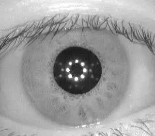
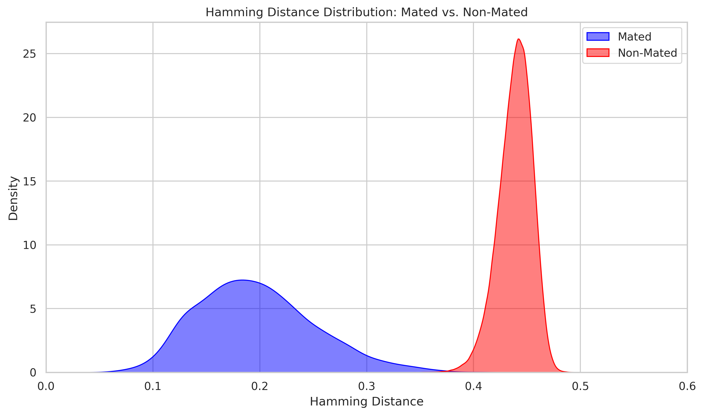

+++
title = "Shapley-waarde-gestuurde optimalisatie van Gabor-filters voor irisherkenning"
description = ""
weight = 1
date = 2025-10-08

[extra]
local_image = "Iris/0.webp"
tags = ["opencv", "python", "biometric", "iris", "numpy", "Shapley Value"]
github = "https://github.com/CatataFish132/iris_recognition"
mathjax = true
+++

Je kunt het volledige wetenschappelijke artikel hier lezen: [Download PDF (Iris.pdf)](Iris.pdf)

## Introductie
Ontwikkeling van een geavanceerd biometrisch irisherkenningssysteem dat coöperatieve speltheorie gebruikt om de traditionele kenmerkextractie-pipeline van John Daugman te optimaliseren. Door Shapley-waarde-gebaseerde kenmerkbepaling toe te passen, evalueert het systeem mathematisch de individuele bijdrage van 2D Gabor-filters om redundantie te elimineren. Deze datagestuurde aanpak resulteert in een sterk gecomprimeerde, computationeel efficiënte en state-of-the-art filterset die een Equal Error Rate (EER) van maar liefst **0,05%** behaalt.

## Projectdetails
- **Kerntechnologieën:** Python, OpenCV, NumPy, Shapley-waarde-optimalisatie, USIT SDK.
- **Gebruikte algoritmen:** 2D Complexe Gabor-filters, Hamming-afstand met binaire maskering.
- **Doeldatasets:** CASIA-IrisV1, IrisV3 en MMU.
- **Mijn rol:** Solo Onderzoeker & Computer Vision Engineer.

## De Uitdaging
- **Propriëtair & Gebrek aan Transparantie:** John Daugmans klassieke iriscode blijft de industriestandaard, maar de specifieke optimale configuratie van Gabor-filters die in moderne commerciële systemen wordt gebruikt, is propriëtair en niet gepubliceerd.
- **Zoekruimte:** Het handmatig vinden van de optimale parameters (envelopgrootte, golforiëntatie, golflengte en stappen) over verschillende Gabor-filtercombinaties creëert een exponentieel complexe zoekruimte.
- **Extreme Gevoeligheid voor Afwijkingen:** Kleine rotationele afwijkingen of verticale verschuivingen (veroorzaakt door imperfecte oogsegmentatie) leiden tot drastische, valse mismatches.

## Belangrijkste Kenmerken & Acties
- **Gebruiksvriendelijke Bibliotheek:** De volledige pipeline is verpakt in een intuïtieve, overzichtelijke en eenvoudig te begrijpen Python-bibliotheek, waardoor andere studenten met slechts een paar regels code end-to-end iriscodering en -matching kunnen uitvoeren.
- **Integratie van Coöperatieve Speltheorie:** Gabor-filters zijn gemodelleerd als "spelers" in een coöperatief spel, waarbij hun marginale bijdrage (Shapley-waarden) is berekend om systematisch filters met een grote impact te behouden en redundante filters weg te snijden.
- **Robuuste Rotationele Uitlijning:** Ontwikkeling van een dynamisch pixelverschuivingscorrectiesysteem op de genormaliseerde irisband om de optimale rotationele matchingshoek te simuleren en te vinden.

## Resultaten

- **State-of-the-Art Nauwkeurigheid:** Behaalde een uitstekende Equal Error Rate (EER) van **0,05%** op de CASIA-IrisV1-dataset, waarmee de benchmark-implementatie van Kong et al. IrisCode werd overtroffen.
- **Beter dan Deep Learning-methoden:** Behaalde een EER van **0,67%** op de IrisV3-dataset, waarmee het de benchmark Deep CNN-benadering (0,76% EER) en alle standaardalgoritmen in de USIT SDK overtrof.
