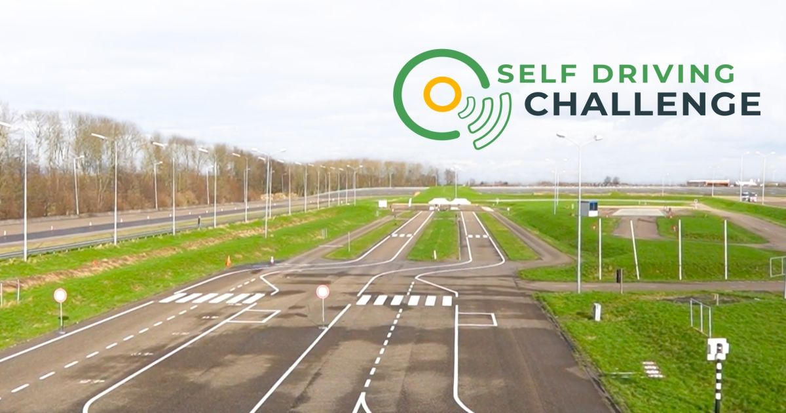
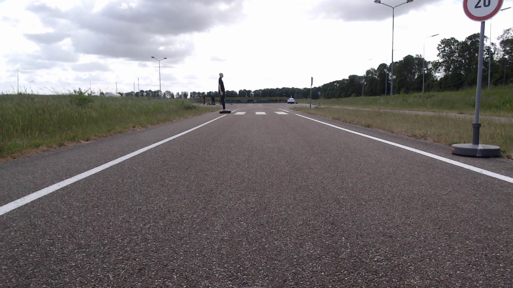
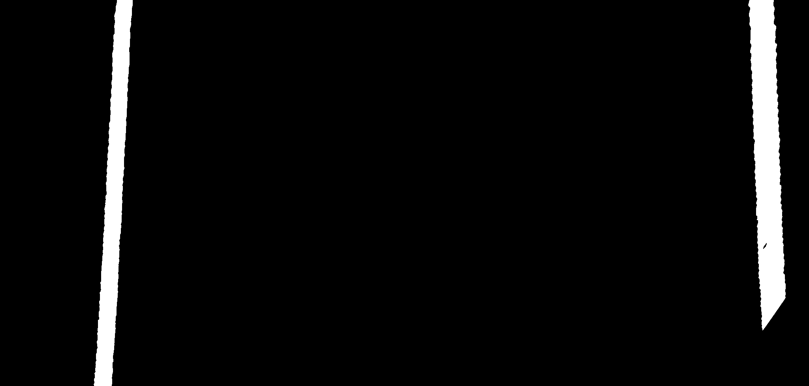
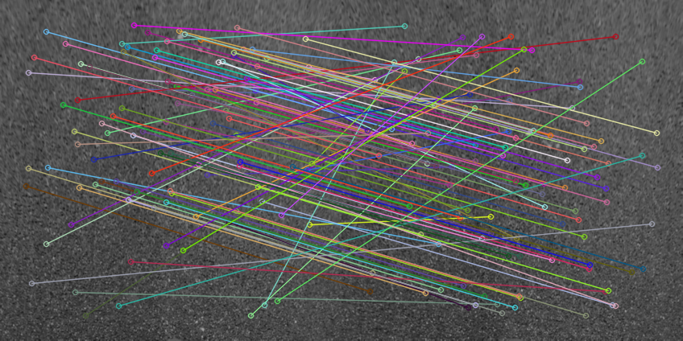
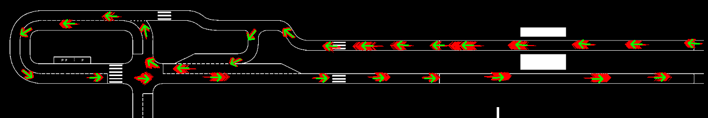

+++
title = "Visual Monocular Localization using a Map and Lane Lines"
description = "Self Driving Challenge"
weight = 1
date = 2025-06-10

[extra]
local_image = "/projects/Visual Monocular Localization/SDC.jpeg"
tags = ["opencv", "python"]
mathjax = true
+++

  
   

You can read the full paper here: [Download PDF (Self Driving Challenge Article Thimo Veldema.pdf)](<Self Driving Challenge Article Thimo Veldema.pdf>)

# Introduction

Developed and deployed a real-time monocular localization system for an autonomous vehicle navigating a closed test track for the annual Dutch RDW (Vehicle Authority) Self Driving Challenge. By utilizing only a single forward-facing camera, the system successfully estimated the vehicle’s position and orientation on the track. This was achieved by combining visual motion tracking (odometry) with real-time lane-line detection, constantly correcting the vehicle's path against a predefined map.
# Challenges

- **Hardware & Sensor Limitations:** Traditional localization sensors like IMUs (Inertial Measurement Units) and wheel encoders were completely unavailable, meaning the vehicle had to navigate relying solely on video inputs.
- **Accumulated Drift:** Pure visual tracking (odometry) naturally accumulates tiny calculation errors over time, causing the vehicle's estimated position to drift significantly off-course.
- **Severe Compute Constraints:** The target vehicle's hardware had strictly limited processing power, requiring lightweight algorithms capable of running in real time.
# Key Features

- **Real-Time Bird's-Eye View (BEV):** Transformed the forward-facing camera feed into a top-down perspective to accurately map and match road markings.
- **Lightweight Lane Segmentation:** Made an HSV color-filtering and Gaussian blur pipeline to isolate lane markings on the road.

  
  
   
  <em>Figure 1: Raw camera input (left) and the resulting high-contrast binary lane mask (right).</em>

- **Robust Motion Tracking:** Implemented a visual odometry pipeline using STAR keypoint detection and ORB descriptors to track relative vehicle movement between frames, using RANSAC to discard visual noise.

  
   
  <em>Figure 2: Micro-texture matches on the asphalt surface to estimate frame-to-frame translation.</em>

- **Probabilistic Localization (MCL):** Developed a particle filter that compares detected lane lines against a reference map using downscaled HOG features ($128\times64$ pixels) for real-time matching.
- **Sensor Fusion via Kalman Filter:** Fused the smooth, short-term motion estimates from the odometry with the long-term corrective updates from the particle filter, resulting in stable and continuous positioning.

  
   
  <em>Figure 3: Map representation. The green arrow is the Kalman-filtered vehicle pose, surrounded by red particles representing the spatial probability distribution.</em>

# Results

- **Alignment:** Achieved a lateral (side-to-side) Mean Absolute Error (MAE) of **7 cm** on straight road segments.
- **Heading Accuracy:** Maintained a rotational Mean Absolute Error of just **0.028 radians** on straight stretches.
- **Adaptive Drifting Recovery:** Successfully navigated complex turns, pedestrian crossings, and stop lines. The system proved robust enough to automatically collapse "uncertain" position estimates the second a recognizable track feature came into view.
- **Modular Architecture:** Built the entire codebase to be modular, allowing the lane detector or odometry modules to be swapped out easily.